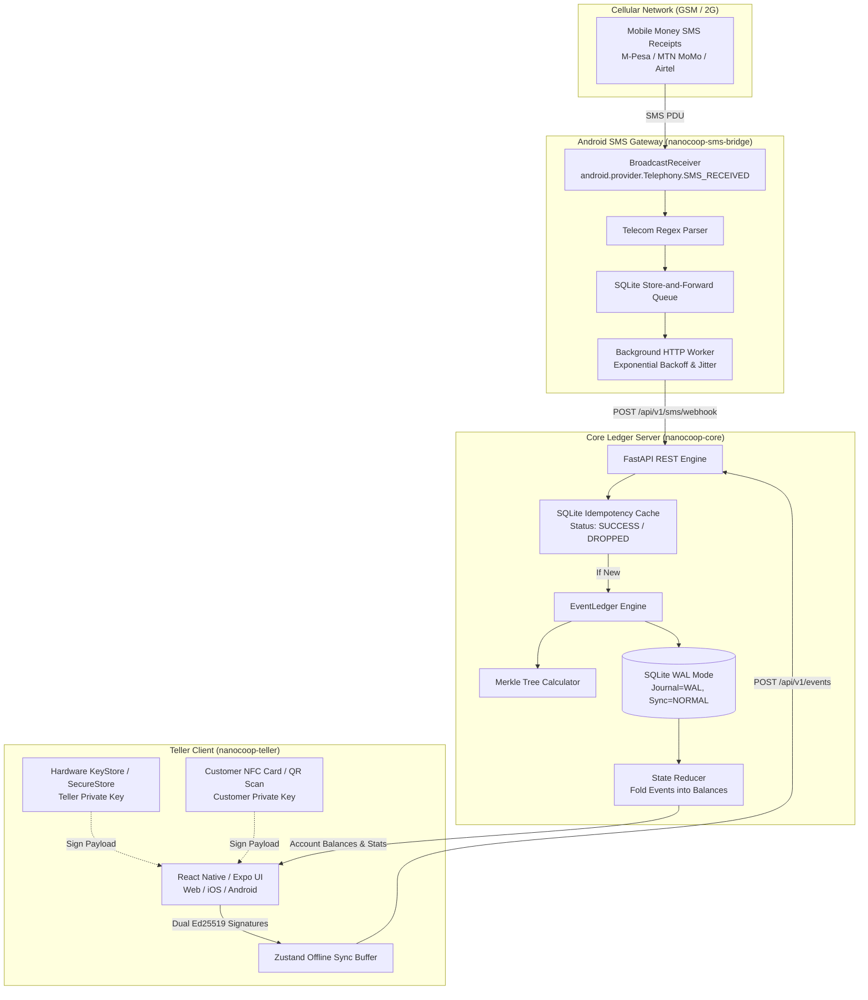
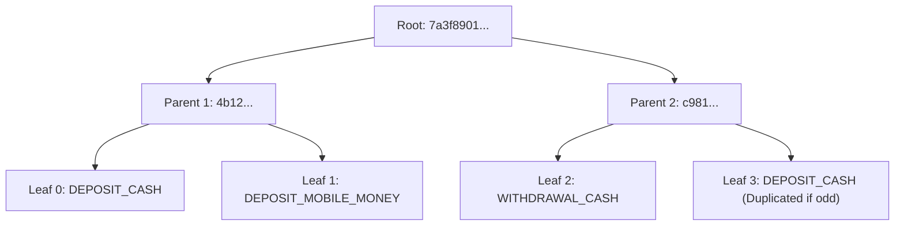

# NanoCoop Architectural Design & Cryptographic Specification

## 1. Vision & The Low-Resource Community Banking Constraint

Rural microfinance groups, Village Savings and Loan Associations (VSLAs), and local agricultural cooperatives frequently operate under harsh infrastructure conditions:
- **Intermittent or Absent Connectivity:** Cellular coverage may be absent for days, or limited to 2G SMS networks.
- **Unreliable Power & Low-End Hardware:** Core ledger nodes may run on low-power single-board computers (such as a Raspberry Pi or low-cost refurbished laptop) prone to abrupt power losses. Teller devices are typically budget Android smartphones with limited RAM.
- **Zero-Trust Environment:** Financial transactions must be cryptographically non-repudiable without relying on centralized cloud authorities or continuous internet connectivity.

NanoCoop solves these challenges through an **offline-first, zero-trust cryptographic banking engine** combining:
1. **Append-Only Event Sourcing** with deterministic SHA-256 hash chaining.
2. **Hierarchical Merkle Trees** for instantaneous mathematical tamper verification.
3. **Ed25519 Multi-Signature Authorization** requiring dual consensus (Teller + Customer NFC/QR).
4. **An Asynchronous Android SMS Bridge** featuring persistent store-and-forward retry queues with exponential backoff and jitter for mobile money integration (M-Pesa, MTN Mobile Money, Airtel Money).
5. **A Cross-Platform Teller Client** with optimistic local state caching and automated sync.

---

## 2. System Architecture



---

## 3. The Append-Only Event Ledger & Deterministic Hashing

### 3.1 The Event Schema
The core database stores immutable events rather than mutable balance rows. Every event contains the complete cryptographic evidence required to verify its validity:

```json
{
  "event_id": "c1f7b8a0-7601-44b2-8419-a9c1e7a4b001",
  "timestamp": 1715694200,
  "event_type": "DEPOSIT_CASH",
  "payload": {
    "amount": 50.00,
    "currency": "USD",
    "user_public_key": "606b821402e2f8784a43be91b1ecd1d4ef7ceb951cdddb4e0d6062007648cd87",
    "notes": "Weekly community deposit"
  },
  "previous_hash": "e3b0c44298fc1c149afbf4c8996fb92427ae41e4649b934ca495991b7852b855",
  "signatures": {
    "teller_sig": "601045bc374accc0d20ec37cf5d02f5b177a6da787c80f9436bc827282a83c19...",
    "user_sig": "a4d9201948ba9820fbc8921e9021481b9487c8a912803b984019283ba874b019..."
  },
  "current_hash": "7a3f8901b045812984ea09214b7e8912c01924b81092a481b901248ba0912481"
}
```

### 3.2 Deterministic Cross-Language Serialization Rule
To guarantee that SHA-256 hashes generated on an Android device (TypeScript/JavaScript) match the Python backend byte-for-byte, keys are sorted recursively and all whitespace separators are removed:

$$\text{CanonicalJSON}(O) = \text{dumps}(O, \text{sort\_keys}=\text{True}, \text{separators}=(',', ':'))$$

```python
def serialize_for_hashing(payload: dict) -> bytes:
    json_string = json.dumps(payload, sort_keys=True, separators=(',', ':'))
    return json_string.encode('utf-8')

def generate_event_hash(previous_hash: str, payload_bytes: bytes, signatures_bytes: bytes) -> str:
    hasher = hashlib.sha256()
    hasher.update(previous_hash.encode('utf-8'))
    hasher.update(payload_bytes)
    hasher.update(signatures_bytes)
    return hasher.hexdigest()
```

---

## 4. Merkle Tree State Proofs

A binary Merkle Tree is constructed across all leaf hashes in chronological order. 
- Leaf hashes: $H_i = \text{SHA-256}(E_i.\text{current\_hash})$
- Odd nodes are balanced by duplicating the trailing leaf: $P = \text{SHA-256}(L \,||\, R)$
- Root hash: $R_{\text{Merkle}} = \text{MerkleRoot}(H_0, H_1, \dots, H_{n-1})$



### Tamper-Evidence Guarantee:
If an attacker alters a historical record in SQLite (e.g., changing a deposit from `$50` to `$5,000`), the following checks will immediately fail:
1. Recalculated `current_hash` will mismatch the stored `current_hash`.
2. The subsequent event's `previous_hash` will fail the cryptographic chain linkage.
3. The computed Merkle Root will diverge from the certified checkpoint hash.

---

## 5. Dual Ed25519 Multi-Signature Workflow

For cash transactions (deposits and withdrawals) handled at a village meeting, neither party is trusted unilaterally:
1. **Teller App** constructs the deterministic payload: `{"amount": 50.0, "currency": "USD", "user_public_key": "..."}`.
2. **Teller Signs:** The Teller's private key (stored in hardware-backed `expo-secure-store` / Android Keystore) signs the payload.
3. **Customer Signs (NFC/QR):** The member taps their cryptographic NFC card (or provides a physical key token). The card signs the exact same payload.
4. **Backend Verification:** `EventLedger.verify_event` verifies:
   - `user_sig` is valid against `payload.user_public_key`.
   - `teller_sig` is valid against authorized teller key.
   - If either signature is invalid or omitted, the transaction is rejected with HTTP 400.

---

## 6. Offline Store-and-Forward Architecture with Idempotency

### 6.1 Android SMS Gateway Store-and-Forward
When mobile money payments arrive via SMS while the core server is powered off or rebooting:
1. `BroadcastReceiver` intercepts `android.provider.Telephony.SMS_RECEIVED`.
2. Telecom parser extracts sender phone, transaction code, and amount.
3. Receipt is stored in local SQLite queue with `attempts = 0` and status `PENDING`.
4. Background worker attempts HTTP delivery.
5. On connection failure, an **exponential backoff with random jitter** is computed:

$$\text{delay} = \min\left(\text{maxBackoffMs}, \, \text{initialBackoffMs} \times 2^{\text{attempts}} + \text{jitter}\right)$$

### 6.2 SQLite Idempotency Cache
Because SMS networks routinely re-transmit packets, duplicate receipts must never double-credit:
1. Compute deterministic `tx_hash = SHA256(code + amount + sender_phone)`.
2. Atomically insert into `idempotency_cache`:
```sql
INSERT INTO idempotency_cache (transaction_hash, processed_at, status)
VALUES (?, ?, 'SUCCESS');
```
3. If primary key conflict occurs, the duplicate request is safely caught, returned with status `DROPPED`, and zero events are added to the ledger.

---

## 7. SQLite High-Resilience WAL Mode Configuration

To prevent `"database is locked"` errors and maximize longevity on slow SD cards (e.g., Raspberry Pi):
```sql
PRAGMA journal_mode = WAL;
PRAGMA synchronous = NORMAL;
PRAGMA foreign_keys = ON;
```
- **Write-Ahead Logging (WAL)** separates read transactions from write transactions, allowing high concurrent throughput.
- **synchronous=NORMAL** provides crash resilience against power outages without disk-sync overhead on every single write.
