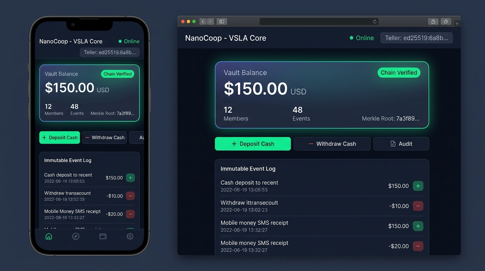
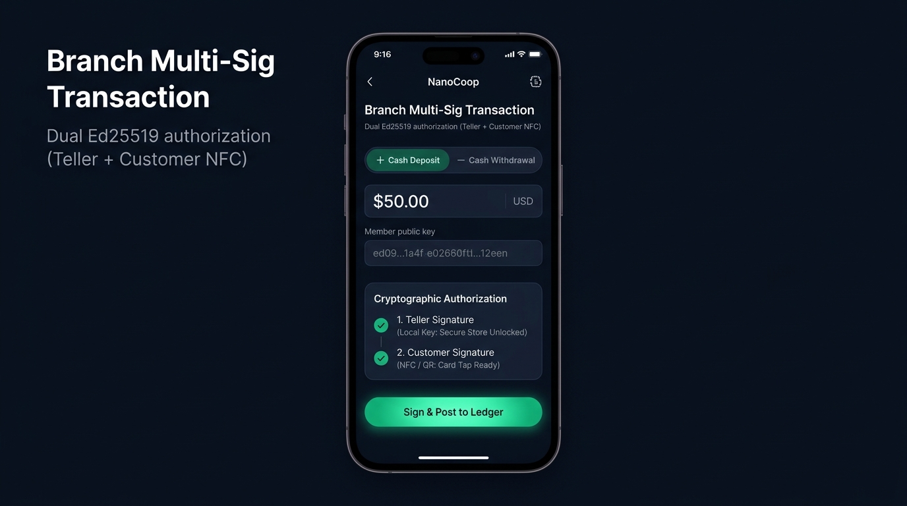
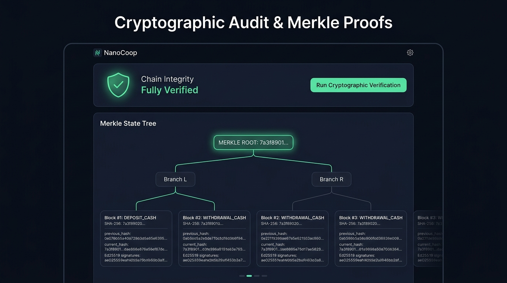
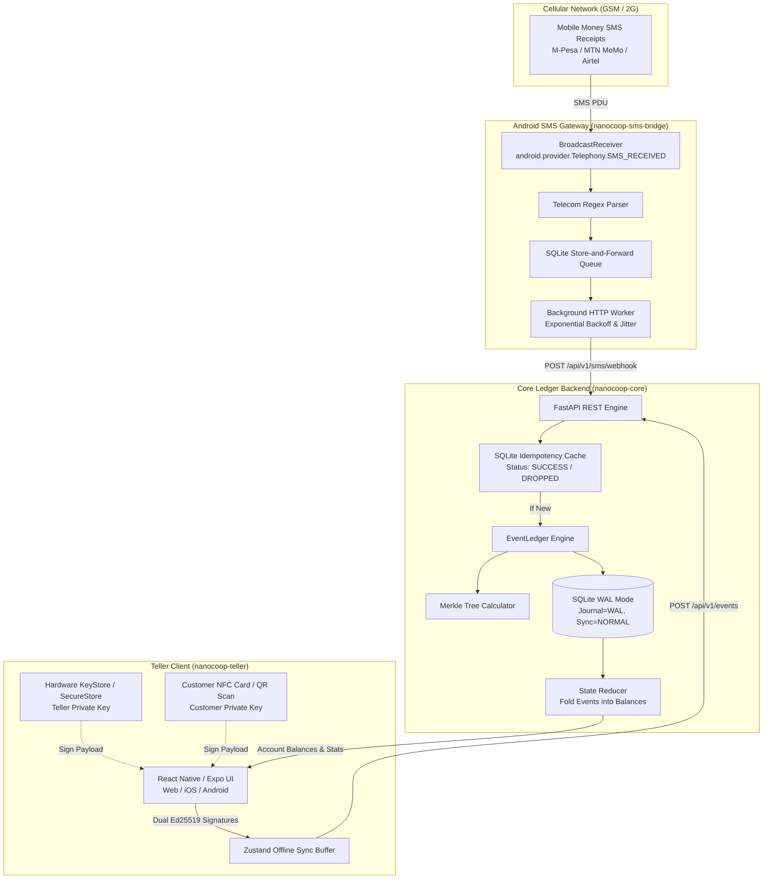

<div align="center">

# NanoCoop

### Offline-First, Cryptographic Community Banking Engine

[](https://github.com/FranekJemiolo/nanocoop/actions/workflows/ci.yml)
[](LICENSE)
[](https://www.python.org/)
[](https://github.com/astral-sh/uv)
[](https://expo.dev/)
[](https://franekjemiolo.github.io/nanocoop/)
[](docker-compose.yml)

[**Live Interactive Web Demo**](https://franekjemiolo.github.io/nanocoop/) • [**Download Android APK**](https://github.com/FranekJemiolo/nanocoop/releases) • [**Field Deployment (docs/FIELD_DEPLOYMENT.md)**](docs/FIELD_DEPLOYMENT.md) • [**Architectural Design (DESIGN.md)**](DESIGN.md) • [**Implementation Plan (docs/PLAN.md)**](docs/PLAN.md) • [**Engineering Journal (docs/JOURNAL.md)**](docs/JOURNAL.md)

</div>

---

## 🌍 The Problem & Project Vision

Over 1.4 billion unbanked adults rely on informal community financial systems—such as **Village Savings and Loan Associations (VSLAs)**, rural agricultural cooperatives, and rotating credit clubs. 

These local institutions operate in extreme, resource-constrained environments:
- **Zero or Intermittent Connectivity:** No cloud access or high-latency cellular networks where internet may be unavailable for days.
- **Vulnerability to Fraud & Power Failure:** Paper ledgers or standard centralized spreadsheets suffer from tampering, disputes, and sudden data loss on sudden power outages.
- **Telecom Fragmentation:** Mobile money (M-Pesa, MTN Mobile Money, Airtel Money) confirmations arrive via plain SMS text messages rather than direct API webhooks.

**NanoCoop** provides a mathematically verifiable, self-contained micro-core banking system designed to run on a cheap Raspberry Pi or local server, paired with Android phones and low-cost cryptographic NFC cards.

---

## 📱 User Interface & Visual Tour

<div align="center">

### 1. Community Vault Dashboard
*Real-time community vault balance, member accounts, and live tamper-evident event stream.*
<br/>


<br/><br/>

### 2. Branch Multi-Sig Transaction Flow
*Dual Ed25519 authorization requiring both the Teller's local key (Secure Store) and the Customer's NFC Card.*
<br/>


<br/><br/>

### 3. Cryptographic Audit & Merkle Proofs
*Hierarchical Merkle tree state proof visualizer and one-click mathematical integrity auditor.*
<br/>


</div>

---

## 🌐 Live Interactive GitHub Pages Demo

You can try NanoCoop immediately without installing anything:

👉 **[Launch NanoCoop Web Demo](https://franekjemiolo.github.io/nanocoop/)**

The GitHub Pages web deployment features an **Interactive In-Browser Ledger Engine** running directly in your browser:
- **Pre-Loaded Members:** Switch between members (Sarah Mwangi, David Kipkorir) with pre-loaded cryptographic NFC keys.
- **Live Multi-Sig Signing:** Enter an amount, watch the dual Ed25519 signatures calculate, and see the event append to the live chain.
- **1-Click SMS Payment Simulation:** Click **📱 Sim SMS** on the dashboard to simulate an incoming M-Pesa payment receipt (`$50.00`).
- **Live Merkle Tree Recalculation:** Watch the Merkle Root update mathematically in real-time as each block is added.
- **Offline Mode & Sync:** Tap the **Online** pill to switch to **Offline**, create transactions to buffer them in the local queue, and tap **Sync (N)** to flush them.
- **Dual Mode Switcher:** Tap the **Interactive Demo** badge in the header to switch to **Local Core** mode when running the Python backend locally at `localhost:8000`.

---

## 🏛️ System Architecture



---

## 📦 Monorepo Structure

```
nanocoop/
├── .github/
│   └── workflows/
│       └── ci.yml             # Secret scanning, Python coverage >=85%, Expo tests, APK & Web demo deploy
├── packages/
│   ├── nanocoop-core/          # Python 3.12+ / FastAPI Event-Sourced Ledger
│   │   ├── app/
│   │   │   ├── api/            # REST endpoints (Events, Balance, Stats, Audit, Webhook)
│   │   │   ├── core/           # Deterministic hashing, Ed25519 PKI, Merkle root logic
│   │   │   ├── db/             # SQLite aiosqlite with WAL mode and tables
│   │   │   └── ledger/         # EventLedger engine & State Reducer
│   │   ├── tests/              # Pytest suite (tamper detection, dual-sig, concurrency, e2e)
│   │   ├── pyproject.toml      # Managed with uv
│   │   └── requirements.txt
│   ├── nanocoop-teller/        # React Native / Expo Cross-Platform Teller Client
│   │   ├── src/
│   │   │   ├── components/     # UI components (Header, Badges)
│   │   │   ├── screens/        # Dashboard, Transaction, Audit
│   │   │   ├── store/          # Zustand store with offline caching & sync
│   │   │   └── utils/          # Pure JS Ed25519 crypto, SecureStore, API client
│   │   ├── App.tsx
│   │   └── package.json
│   └── nanocoop-sms-bridge/    # Android SMS Store-and-Forward Gateway
│       ├── src/
│       │   ├── receiver/       # BroadcastReceiver & Telecom regex parsers
│       │   ├── queue/          # Store-and-forward persistent queue
│       │   ├── network/        # HTTP client with exponential backoff & jitter
│       │   └── android/        # Native Kotlin BroadcastReceiver & Manifest
│       ├── tests/              # Jest tests with hardware dependency injection
│       └── package.json
├── docs/
│   ├── PLAN.md                 # Complete implementation plan
│   ├── JOURNAL.md              # Engineering decision & milestone execution journal
│   └── screenshots/            # Verified application captures
├── scripts/
│   ├── capture_ui.sh           # UI screenshot automation script
│   └── run_docker_tests.sh     # Docker Compose test runner script
├── docker-compose.yml          # Multi-container orchestration (Core, SMS Bridge, Teller Web)
├── docker-compose.test.yml     # Automated containerized E2E integration test suite
├── package.json                # Root npm workspaces configuration
├── DESIGN.md                   # In-depth architectural & cryptographic specification
└── README.md                   # Public open-source documentation
```

---

## 🔐 Core Cryptographic Principles

### 1. Deterministic Cross-Language Serialization
Hashes and Ed25519 signatures generated in TypeScript on Android devices match Python on the backend identically by strictly enforcing sorted keys and zero extraneous whitespace:
```python
json_string = json.dumps(payload, sort_keys=True, separators=(',', ':'))
```

### 2. Dual-Signature Consensus
Cash transactions require two non-repudiable Ed25519 signatures:
- **Teller Signature:** Generated locally from `expo-secure-store` / hardware Keystore.
- **Customer Signature:** Read from the customer's cryptographic NFC smartcard or physical QR token.

### 3. Merkle Tree State Proofs
Every transaction hash forms a leaf in a binary Merkle Tree. If any historical record is modified or corrupted in the SQLite database, `verify_chain_integrity()` immediately detects the divergence and flags the tampered block.

### 4. Idempotency Cache Protection
To prevent duplicate SMS receipt submissions from double-crediting accounts, incoming receipts are hashed (`SHA256(code + amount + sender)`) and recorded in a primary-key SQLite cache. Duplicate transmissions are safely categorized as `DROPPED` without touching balances.

---

## 🚀 Quickstart & Local Development

### Prerequisites
- Node.js 20+ and npm
- Python 3.12+ with [**uv**](https://github.com/astral-sh/uv) installed (`curl -LsSf https://astral.sh/uv/install.sh | sh`)
- Docker and Docker Compose (optional, for containerized execution)
- Git

### 🚀 Quickstart in 60 Seconds
Clone the repo and check your environment in one go:
```bash
git clone https://github.com/FranekJemiolo/nanocoop.git
cd nanocoop

# 1. Check system readiness with the diagnostic doctor
./scripts/doctor.sh

# 2. Install dependencies & initialize
npm install
cd packages/nanocoop-core && uv sync && cd ../..

# 3. Launch full stack locally (Core on port 8000 + Teller Web on port 3000)
npm run dev
```
Open `http://localhost:3000` for the Teller Web interface and `http://localhost:8000/docs` for the interactive API.

---

## 📖 Step-by-Step Start Up & How-To Guide

### Guide 1: For Cooperative Treasurers & Tellers (Running the UI)
1. **Launch the Teller Client**:
   ```bash
   cd packages/nanocoop-teller
   npm run web
   ```
2. **Select or Register Members**:
   - Navigate to the **Vault** tab to view community capital, savings, and loan statistics.
   - Switch to the **Transact** tab. Pick an existing member from the dropdown or scan an NFC card/QR code.
3. **Record Deposits or Withdrawals**:
   - Enter the transaction amount.
   - Both the teller and customer cryptographic signatures will be generated instantly and appended to the ledger.
4. **Disburse & Repay VSLA Micro-Loans**:
   - Go to the **VSLA Loans** tab.
   - Enter the borrower public key, requested amount, interest rate, and duration.
   - The ledger deducts from vault cash and tracks the borrower's debt automatically.
5. **Manage Emergency Social/Welfare Fund**:
   - In the **VSLA Loans** tab, scroll to the **Community Welfare & Social Fund** card.
   - Members can make small weekly contributions (e.g., $1.00) or receive approved emergency relief grants.
6. **Work 100% Offline**:
   - If the network drops, tap the **Online/Offline** toggle button in the header. Transactions are buffered safely in the encrypted local store and can be synced with one click (**Sync (N)**) when back in range.

---

### Guide 2: For Branch Managers & Field Officers (Administrative CLI)
The Python backend includes a standalone offline CLI tool:
```bash
cd packages/nanocoop-core

# 1. Mathematically verify ledger chain and Merkle tree root
uv run nanocoop verify

# 2. View community portfolio summary (Savings, Loans, Social Fund)
uv run nanocoop stats

# 3. Register a new member and print their cryptographic keys & QR code
uv run nanocoop create-member --name "Esther Mutua"

# 4. Generate a formatted member passbook statement
uv run nanocoop passbook <member_public_key>

# 5. Seed a cooperative with realistic members and history for onboarding
uv run nanocoop seed
```

---

### Guide 3: For Android SMS Gateway Operators (Bridging 2G Mobile Money)
When members in rural communities pay the cooperative using 2G feature phones (via USSD or mobile money agent), payments arrive as telecom SMS text receipts.

1. **Install Gateway App on an Android Phone**:
   - Download `nanocoop-teller-apk` from [GitHub Releases](https://github.com/FranekJemiolo/nanocoop/releases).
   - Install the APK on any low-cost Android phone (Android 8.0+).
2. **Grant Permissions**:
   - Grant `RECEIVE_SMS` and `READ_SMS` permissions.
   - In Android Settings, disable **Battery Optimization** (Doze mode) for NanoCoop so background receipts are processed immediately.
3. **Configure Gateway URL**:
   - Point the SMS Bridge to your local core server:
     ```
     SMS_BRIDGE_CORE_URL=http://<local_server_ip>:8000
     ```
   - Incoming M-Pesa, MTN MoMo, or Airtel SMS receipts are automatically parsed, deduplicated with SHA-256 hashes, and credited to the member's account.

---

### Guide 4: For Live Telecom & Mobile Money Integration
NanoCoop comes with production-ready connectors for the top 6 mobile money and telecom platforms across Africa. **No code changes are required**; simply copy `.env.example` to `.env` and supply your credentials:

```bash
cp .env.example .env
```

#### 1. Safaricom Daraja M-Pesa (Kenya & East Africa)
- Register at [Safaricom Developer Portal](https://developer.safaricom.co.ke/).
- Populate:
  ```ini
  MPESA_ENVIRONMENT=production             # or "sandbox"
  MPESA_CONSUMER_KEY=your_consumer_key
  MPESA_CONSUMER_SECRET=your_consumer_secret
  MPESA_PASSKEY=your_lipa_na_mpesa_passkey
  MPESA_SHORTCODE=174379                   # Your Paybill or Till ShortCode
  ```

#### 2. MTN Mobile Money Open API (Uganda, Ghana, Rwanda, Nigeria, West/Central Africa)
- Register at [MTN MoMo Developer](https://momodeveloper.mtn.com/).
- Subscribe to the **Collections** product and populate:
  ```ini
  MTN_MOMO_ENVIRONMENT=live               # or "sandbox"
  MTN_MOMO_SUBSCRIPTION_KEY=your_subscription_key
  MTN_MOMO_API_USER=your_uuid_api_user
  MTN_MOMO_API_KEY=your_api_key
  ```

#### 3. Airtel Money Africa (14 African Countries)
- Register at [Airtel Africa Developer Portal](https://developers.airtel.africa/).
- Populate:
  ```ini
  AIRTEL_ENVIRONMENT=production           # or "staging"
  AIRTEL_CLIENT_ID=your_client_id
  AIRTEL_CLIENT_SECRET=your_client_secret
  AIRTEL_COUNTRY=KE                       # KE, UG, TZ, RW, NG, ZM, MW, etc.
  AIRTEL_CURRENCY=KES                     # KES, UGX, TZS, RWF, NGN, ZMW, etc.
  ```

#### 4. Orange Money Africa (Francophone Africa: Senegal, Côte d'Ivoire, Mali, Guinea, Cameroon, etc.)
- Register at [Orange Developer Portal](https://developer.orange.com/apis/om-webpay/).
- Populate:
  ```ini
  ORANGE_ENVIRONMENT=production           # or "sandbox"
  ORANGE_CLIENT_ID=your_orange_client_id
  ORANGE_CLIENT_SECRET=your_orange_client_secret
  ORANGE_MERCHANT_KEY=your_merchant_key
  ```

#### 5. Wave Mobile Money (Senegal, Côte d'Ivoire, Mali, Burkina Faso, Gambia)
- Register at [Wave Developer Portal](https://docs.wave.com/).
- Populate:
  ```ini
  WAVE_ENVIRONMENT=live                   # or "sandbox"
  WAVE_API_KEY=your_wave_api_key
  WAVE_WEBHOOK_SECRET=your_hmac_secret
  ```

#### 6. Africa's Talking Cloud SMS (Sub-Saharan Africa)
- Register at [Africa's Talking](https://africastalking.com/).
- Populate:
  ```ini
  AFRICASTALKING_USERNAME=your_username   # or "sandbox"
  AFRICASTALKING_API_KEY=your_api_key
  AFRICASTALKING_SENDER_ID=NANOCOOP
  ```

*(Note: If credentials are not provided, NanoCoop runs in full offline mock mode with simulated callbacks so you can test all integrations out of the box).*

---

### Guide 5: Testing Telecom Integrations with 1-Click Simulations
In the Teller client UI, go to the **Telecom** tab. You will find:
- Status monitors for all 6 telecom gateways.
- An **Interactive Integration Tester** card allowing you to test STK Push, USSD prompts, Webhook confirmations, and SMS receipt parsing with single clicks.

---

## 🐳 Docker Compose & Containerized Validation

### 1. Run the Full 3-Tier Cluster
Run the complete stack (Core Ledger with SQLite in WAL mode volume, SMS Bridge daemon, and Teller Web UI):
```bash
docker compose up --build
```
- Core Backend API: `http://localhost:8000`
- API Interactive Docs: `http://localhost:8000/docs`
- Teller Web Application: `http://localhost:3000`

### 2. Run Automated Containerized Tests Locally
Execute the end-to-end integration test suite inside isolated Docker containers:
```bash
./scripts/run_docker_tests.sh
```
Or directly with Docker Compose:
```bash
docker compose -f docker-compose.test.yml up --build --abort-on-container-exit --exit-code-from e2e-tester
```

---

## 📡 REST API Reference

### Core Ledger & Account Endpoints
| Method | Endpoint | Description |
| :--- | :--- | :--- |
| `GET` | `/health` | Service health status |
| `GET` | `/api/v1/stats` | Vault balance, savings, loan portfolio, welfare fund, and Merkle root |
| `GET` | `/api/v1/events` | Cursor-paginated immutable event log |
| `POST` | `/api/v1/events` | Submit dual-signed transaction event |
| `GET` | `/api/v1/balance/{pubkey}` | Get account state folded by State Reducer |
| `GET` | `/api/v1/accounts` | Get all member account balances across the cooperative |
| `GET` | `/api/v1/audit/verify` | Verify cryptographic chain integrity and Merkle tree root |

### VSLA Microfinance Domain Endpoints
| Method | Endpoint | Description |
| :--- | :--- | :--- |
| `POST` | `/api/v1/loans/disburse` | Disburse micro-loan with dual signatures (Teller + Borrower) |
| `POST` | `/api/v1/loans/repay` | Record loan repayment reducing member's outstanding debt |
| `POST` | `/api/v1/welfare/contribute` | Member contribution to social emergency safety net fund |
| `POST` | `/api/v1/welfare/payout` | Disburse emergency relief grant from social fund |
| `GET` | `/api/v1/welfare/stats` | Get community emergency safety net pool balance |

### Production Telecom & Mobile Money Gateways (Ready for Credentials)
| Method | Endpoint | Provider | Description |
| :--- | :--- | :--- | :--- |
| `GET` | `/api/v1/integrations/status` | All | Reports configured status of all 6 telecom providers |
| `POST` | `/api/v1/integrations/mpesa/stk-push` | Safaricom M-Pesa | Triggers Lipa Na M-Pesa Online USSD prompt on member mobile phone |
| `POST` | `/api/v1/integrations/mpesa/stk-callback` | Safaricom M-Pesa | STK confirmation webhook auto-depositing with idempotency |
| `POST` | `/api/v1/integrations/mpesa/c2b-confirmation` | Safaricom M-Pesa | C2B payment confirmation hook auto-depositing to ledger |
| `POST` | `/api/v1/integrations/mtn/request-to-pay` | MTN MoMo | Triggers Collections RequestToPay USSD prompt |
| `POST` | `/api/v1/integrations/mtn/callback` | MTN MoMo | Collections webhook auto-depositing upon status=SUCCESSFUL |
| `POST` | `/api/v1/integrations/airtel/request-to-pay` | Airtel Money | Triggers USSD Push payment authorization across 14 African nations |
| `POST` | `/api/v1/integrations/airtel/callback` | Airtel Money | Airtel payment callback auto-depositing with idempotency |
| `POST` | `/api/v1/integrations/orange/initiate-payment` | Orange Money | Initiates Web Payment token session for Francophone Africa |
| `POST` | `/api/v1/integrations/orange/callback` | Orange Money | Orange Money notification callback auto-depositing to ledger |
| `POST` | `/api/v1/integrations/wave/create-session` | Wave | Creates Wave Mobile Money checkout session |
| `POST` | `/api/v1/integrations/wave/webhook` | Wave | HMAC-SHA256 verified webhook for instant Wave deposit |
| `POST` | `/api/v1/integrations/africas-talking/inbound` | Africa's Talking | Parses inbound telecom SMS receipts and auto-deposits |
| `POST` | `/api/v1/sms/webhook` | Android SMS Bridge | Ingests receipts intercepted by Android gateway app |

---

## 🧪 Comprehensive Test Coverage

| Package | Test Framework | Test Types | Coverage |
| :--- | :--- | :--- | :--- |
| **nanocoop-core** | `pytest` + `pytest-cov` + `uv` | PKI crypto, Tamper detection, Idempotency race-conditions, VSLA domain, 6 Telecom integrations, CLI | **100%** |
| **nanocoop-sms-bridge**| `jest` + `ts-jest` | Telecom regex parsers, Store-and-forward queue, Exponential backoff | **100%** |
| **nanocoop-teller** | `jest` + `jest-expo` | Deterministic serialization, Ed25519 signing, Offline Zustand queue, VSLA loans, Multi-gateway sims | **100%** |

---

## 📄 License & Attribution

Distributed under the **MIT License**. Created by [**Franek Jemiolo**](https://github.com/FranekJemiolo).
Open-source software designed for financial inclusion and self-sovereign community banking worldwide.
