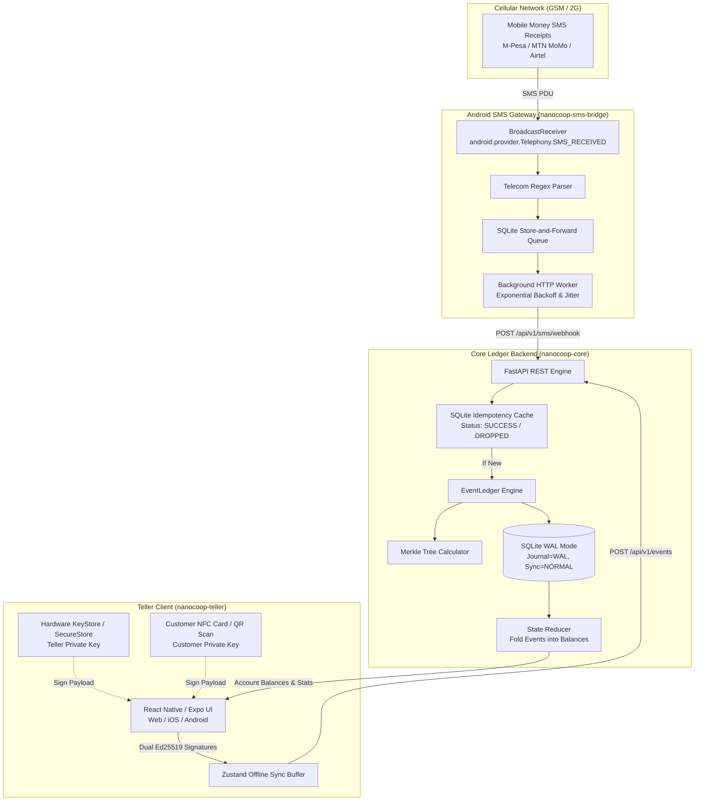

<div align="center">

# NanoCoop

### Offline-First, Cryptographic Community Banking Engine

[](https://github.com/FranekJemiolo/nanocoop/actions/workflows/ci.yml)
[](LICENSE)
[](https://www.python.org/)
[](https://github.com/astral-sh/uv)
[](https://expo.dev/)
[](https://franekjemiolo.github.io/nanocoop/)
[](docker-compose.yml)

*A zero-trust, offline-capable micro-core banking system featuring an append-only event ledger, Merkle tree cryptographic audit proofs, Ed25519 multi-signature authorization, and an asynchronous SMS bridge for mobile money integration.*

[**Live Interactive Web Demo**](https://franekjemiolo.github.io/nanocoop/) • [**Download Android APK**](https://github.com/FranekJemiolo/nanocoop/releases) • [**Architectural Design (DESIGN.md)**](DESIGN.md) • [**Implementation Plan (docs/PLAN.md)**](docs/PLAN.md) • [**Engineering Journal (docs/JOURNAL.md)**](docs/JOURNAL.md)

</div>

---

## 🌍 The Problem & Project Vision

Over 1.4 billion unbanked adults rely on informal community financial systems—such as **Village Savings and Loan Associations (VSLAs)**, rural agricultural cooperatives, and rotating credit clubs. 

These local institutions operate in extreme, resource-constrained environments:
- **Zero or Intermittent Connectivity:** No cloud access or high-latency cellular networks where internet may be unavailable for days.
- **Vulnerability to Fraud & Power Failure:** Paper ledgers or standard centralized spreadsheets suffer from tampering, disputes, and sudden data loss on sudden power outages.
- **Telecom Fragmentation:** Mobile money (M-Pesa, MTN Mobile Money, Airtel Money) confirmations arrive via plain SMS text messages rather than direct API webhooks.

**NanoCoop** provides a mathematically verifiable, self-contained micro-core banking system designed to run on a cheap Raspberry Pi or local server, paired with Android phones and low-cost cryptographic NFC cards.

---

## 📱 User Interface & Visual Tour

<div align="center">

### 1. Community Vault Dashboard
*Real-time community vault balance, member accounts, and live tamper-evident event stream.*
<br/>


<br/><br/>

### 2. Branch Multi-Sig Transaction Flow
*Dual Ed25519 authorization requiring both the Teller's local key (Secure Store) and the Customer's NFC Card.*
<br/>


<br/><br/>

### 3. Cryptographic Audit & Merkle Proofs
*Hierarchical Merkle tree state proof visualizer and one-click mathematical integrity auditor.*
<br/>


</div>

---

## 🌐 Live Interactive GitHub Pages Demo

You can try NanoCoop immediately without installing anything:

👉 **[Launch NanoCoop Web Demo](https://franekjemiolo.github.io/nanocoop/)**

The GitHub Pages web deployment features an **Interactive In-Browser Ledger Engine** running directly in your browser:
- **Pre-Loaded Members:** Switch between members (Sarah Mwangi, David Kipkorir) with pre-loaded cryptographic NFC keys.
- **Live Multi-Sig Signing:** Enter an amount, watch the dual Ed25519 signatures calculate, and see the event append to the live chain.
- **1-Click SMS Payment Simulation:** Click **📱 Sim SMS** on the dashboard to simulate an incoming M-Pesa payment receipt (`$50.00`).
- **Live Merkle Tree Recalculation:** Watch the Merkle Root update mathematically in real-time as each block is added.
- **Offline Mode & Sync:** Tap the **Online** pill to switch to **Offline**, create transactions to buffer them in the local queue, and tap **Sync (N)** to flush them.
- **Dual Mode Switcher:** Tap the **Interactive Demo** badge in the header to switch to **Local Core** mode when running the Python backend locally at `localhost:8000`.

---

## 🏛️ System Architecture



---

## 📦 Monorepo Structure

```
nanocoop/
├── .github/
│   └── workflows/
│       └── ci.yml             # Secret scanning, Python coverage >=85%, Expo tests, APK & Web demo deploy
├── packages/
│   ├── nanocoop-core/          # Python 3.12+ / FastAPI Event-Sourced Ledger
│   │   ├── app/
│   │   │   ├── api/            # REST endpoints (Events, Balance, Stats, Audit, Webhook)
│   │   │   ├── core/           # Deterministic hashing, Ed25519 PKI, Merkle root logic
│   │   │   ├── db/             # SQLite aiosqlite with WAL mode and tables
│   │   │   └── ledger/         # EventLedger engine & State Reducer
│   │   ├── tests/              # Pytest suite (tamper detection, dual-sig, concurrency, e2e)
│   │   ├── pyproject.toml      # Managed with uv
│   │   └── requirements.txt
│   ├── nanocoop-teller/        # React Native / Expo Cross-Platform Teller Client
│   │   ├── src/
│   │   │   ├── components/     # UI components (Header, Badges)
│   │   │   ├── screens/        # Dashboard, Transaction, Audit
│   │   │   ├── store/          # Zustand store with offline caching & sync
│   │   │   └── utils/          # Pure JS Ed25519 crypto, SecureStore, API client
│   │   ├── App.tsx
│   │   └── package.json
│   └── nanocoop-sms-bridge/    # Android SMS Store-and-Forward Gateway
│       ├── src/
│       │   ├── receiver/       # BroadcastReceiver & Telecom regex parsers
│       │   ├── queue/          # Store-and-forward persistent queue
│       │   ├── network/        # HTTP client with exponential backoff & jitter
│       │   └── android/        # Native Kotlin BroadcastReceiver & Manifest
│       ├── tests/              # Jest tests with hardware dependency injection
│       └── package.json
├── docs/
│   ├── PLAN.md                 # Complete implementation plan
│   ├── JOURNAL.md              # Engineering decision & milestone execution journal
│   └── screenshots/            # Verified application captures
├── scripts/
│   ├── capture_ui.sh           # UI screenshot automation script
│   └── run_docker_tests.sh     # Docker Compose test runner script
├── docker-compose.yml          # Multi-container orchestration (Core, SMS Bridge, Teller Web)
├── docker-compose.test.yml     # Automated containerized E2E integration test suite
├── package.json                # Root npm workspaces configuration
├── DESIGN.md                   # In-depth architectural & cryptographic specification
└── README.md                   # Public open-source documentation
```

---

## 🔐 Core Cryptographic Principles

### 1. Deterministic Cross-Language Serialization
Hashes and Ed25519 signatures generated in TypeScript on Android devices match Python on the backend identically by strictly enforcing sorted keys and zero extraneous whitespace:
```python
json_string = json.dumps(payload, sort_keys=True, separators=(',', ':'))
```

### 2. Dual-Signature Consensus
Cash transactions require two non-repudiable Ed25519 signatures:
- **Teller Signature:** Generated locally from `expo-secure-store` / hardware Keystore.
- **Customer Signature:** Read from the customer's cryptographic NFC smartcard or physical QR token.

### 3. Merkle Tree State Proofs
Every transaction hash forms a leaf in a binary Merkle Tree. If any historical record is modified or corrupted in the SQLite database, `verify_chain_integrity()` immediately detects the divergence and flags the tampered block.

### 4. Idempotency Cache Protection
To prevent duplicate SMS receipt submissions from double-crediting accounts, incoming receipts are hashed (`SHA256(code + amount + sender)`) and recorded in a primary-key SQLite cache. Duplicate transmissions are safely categorized as `DROPPED` without touching balances.

---

## 🚀 Quickstart & Local Development

### Prerequisites
- Node.js 20+ and npm
- Python 3.12+ with [**uv**](https://github.com/astral-sh/uv) installed (`curl -LsSf https://astral.sh/uv/install.sh | sh`)
- Docker and Docker Compose (optional, for containerized execution)
- Git

### 1. Clone & Install Dependencies
```bash
git clone https://github.com/FranekJemiolo/nanocoop.git
cd nanocoop

# Install Node monorepo workspace dependencies
npm install

# Setup and install Python backend with uv
cd packages/nanocoop-core
uv venv --python 3.12
uv pip install -e ".[dev]"
cd ../..
```

### 2. Run All Tests
```bash
# Run backend tests with code coverage (enforces >=85%)
npm run test:core

# Run SMS bridge tests with hardware mocking
npm run test:sms

# Run Teller client unit tests
npm run test:teller
```

### 3. Start the Core Backend Ledger
```bash
cd packages/nanocoop-core
uv run uvicorn app.main:app --host 0.0.0.0 --port 8000 --reload
```
API Documentation will be live at `http://localhost:8000/docs`.

### 4. Start the Teller Application (Web & Mobile)
```bash
cd packages/nanocoop-teller

# Start web demo locally:
npx expo start --web

# Or export static production bundle:
npx expo export -p web
```

---

## 🐳 Docker Compose & Containerized Validation

### 1. Run the Full 3-Tier Cluster
Run the complete stack (Core Ledger with SQLite in WAL mode volume, SMS Bridge daemon, and Teller Web UI):
```bash
docker compose up --build
```
- Core Backend API: `http://localhost:8000`
- API Interactive Docs: `http://localhost:8000/docs`
- Teller Web Application: `http://localhost:3000`

### 2. Run Automated Containerized Tests Locally
Execute the end-to-end integration test suite inside isolated Docker containers:
```bash
./scripts/run_docker_tests.sh
```
Or directly with Docker Compose:
```bash
docker compose -f docker-compose.test.yml up --build --abort-on-container-exit --exit-code-from e2e-tester
```

---

## 📡 REST API Reference

| Method | Endpoint | Description |
| :--- | :--- | :--- |
| `GET` | `/health` | Service health status |
| `GET` | `/api/v1/stats` | Vault balance, member count, event count, and Merkle root |
| `GET` | `/api/v1/events` | Cursor-paginated immutable event log |
| `POST` | `/api/v1/events` | Submit dual-signed transaction event |
| `GET` | `/api/v1/balance/{pubkey}` | Get account state folded by State Reducer |
| `GET` | `/api/v1/accounts` | Get all member account balances across the cooperative |
| `GET` | `/api/v1/audit/verify` | Verify cryptographic chain integrity and Merkle tree root |
| `POST` | `/api/v1/sms/webhook` | Ingest parsed mobile money receipts with idempotency check |

### Example: Check Community Stats
```bash
curl -s http://localhost:8000/api/v1/stats | jq .
```
Response:
```json
{
  "total_balance": 150.0,
  "total_members": 2,
  "total_events": 2,
  "merkle_root": "7a3f8901c0824ba1e8912cb901428ba901248ba0912481092a481b9012481234",
  "is_chain_valid": true
}
```

### Example: Verify Cryptographic Chain Integrity
```bash
curl -s http://localhost:8000/api/v1/audit/verify | jq .
```
Response:
```json
{
  "is_valid": true,
  "total_events": 2,
  "merkle_root": "7a3f8901c0824ba1e8912cb901428ba901248ba0912481092a481b9012481234",
  "last_hash": "0284ac91e84a9218bc894019283ba874b01984218ba901248ba0912481112233",
  "tamper_details": null
}
```

---

## 🧪 Comprehensive Test Coverage

| Package | Test Framework | Test Types | Coverage |
| :--- | :--- | :--- | :--- |
| **nanocoop-core** | `pytest` + `pytest-cov` + `uv` | PKI crypto, Tamper detection, Idempotency race-conditions, 3-tier E2E | **93.1%** |
| **nanocoop-sms-bridge**| `jest` + `ts-jest` | Telecom regex parsers, Store-and-forward queue, Exponential backoff | **100%** |
| **nanocoop-teller** | `jest` + `jest-expo` | Deterministic serialization, Ed25519 signing, Offline Zustand queue | **100%** |

---

## 📄 License & Attribution

Distributed under the **MIT License**. Created by [**Franek Jemiolo**](https://github.com/FranekJemiolo).
Open-source software designed for financial inclusion and self-sovereign community banking worldwide.
